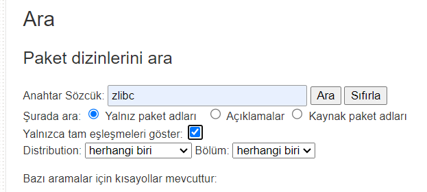
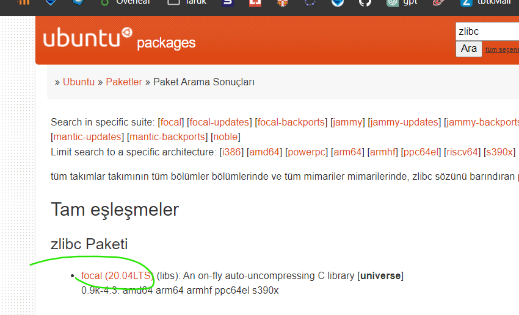
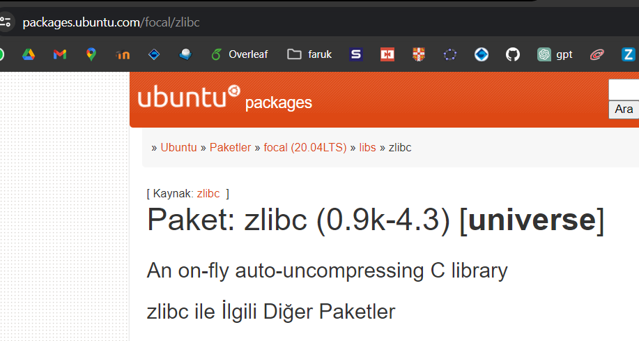

# ubuntu paket kurmada karşılaşılabilecek hata'lar

gnu riscv compiler'ın dependency'lerini kurarken "couldn't locate ***" gibi hatalarla karşılaşmıştım.


  - mesela zlibc'yi `apt-get update` veya `apt update` yapsam bile `apt-get` veya `apt` bulamamıştı.


  - [şurada](https://askubuntu.com/questions/378558/unable-to-locate-package-while-trying-to-install-packages-with-apt#:~:text=First%2C%20check%20if%20the%20package%20actually%20does%20exist%3A) yazdığı gibi paket'in ismini, internet adresini ve hangi repo'da olduğunu öğrendim.
  
  

  
  
  

  - `universe` repo'sunda, `focal` dağıtımında bulunan bir paket. internet adresi de `packages.ubuntu.com` (terimlerde hata yapıyor olabilirim)
  
  - önce `universe` repo'sunun ekli olmama (`apt update` yaptığımda kontrol edilmiyor olma) ihtimaline karşı 
```bash
sudo add-apt-repository universe # bunu calistirdim.
```

  - bu da işe yaramazsa: `apt update` yaptığımızda `apt`ın (veya `apt-get update` yaptığımızda `apt-get`in) tüm paket isimlerini öğrenmek için kontrol ettiği kaynaklar listesini içeren bir dosya var: `/etc/apt/sources.list`. o dosyayı güncelleyeceğiz ki `packages.ubuntu.com` internet adresindeki `universe` repo'sundaki `focal` dağıtımında bulunan paket isimlerini de alsın. 

```bash
sudo cp /etc/apt/sources.list /etc/apt/sources.list.backup # yedekleme


# deb: derlenmis versiyonlar
# deb-src: kaynak kodlar

# packages.ubuntu.com'dan sonra neden /ubuntu/ koydugumuzu bilmiyorum
sudo add-apt-repository "deb https://packages.ubuntu.com/ubuntu/ focal universe"

# echo "deb http://packages.ubuntu.com/ubuntu focal universe" | sudo tee -a /etc/apt/sources.list

# sonra yine 
sudo apt update

```

yaptıktan sonra kurulumu (`sudo apt install`) yeniden deneyebiliriz.


ayrıntılı bilgi için:

- https://help.ubuntu.com/community/Repositories/CommandLine

